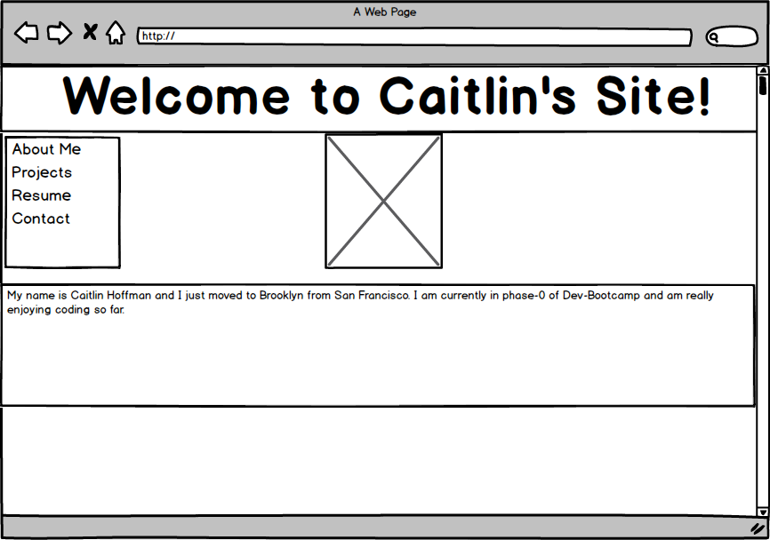

What is a wireframe?
Wireframing is an extremely important step in the website design process. It allows you the plan a layout of how you wish to present your information. Wireframing is the equivalent of a building blueprint in architecture. It can also be helpful to help you see how a user will interact with your site. A strong wireframe is a the foundation of any great website, once you have the basis you can become more creative and add more elaborate aspects to your site.

What are the benefits of wireframing?
As discussed above, there are numerous benefits of wireframing. In the design process most coders sketch what they want, design a wireframe, then a more hi-def wireframe, look over the visual, and afterall that create the code. 

Did you enjoy wireframing your site?
Yes I did enoy it, I like being able to create a layout which I can reference later on.

Did you revise your wireframe or stick with your first idea?
I basically stuck with my original design and just made a few tweeks to font size and the order of my menu.

What questions did you ask during this challenge? What resources did you find to help you answer them?
I mainly asked myself about what what made me like the sites I visit the most often, I basically kept putting myself in the users' position. I found the "A Beginner's Guide to Wireframing" to be a very helpful resource and I designed my wireframe using Balsamiq Mockup.

Which parts of the challenge did you enjoy and which parts did you find tedious?
I enjoyed the actualy design process and found the push/pull files part of the challenge a bit tedious. 