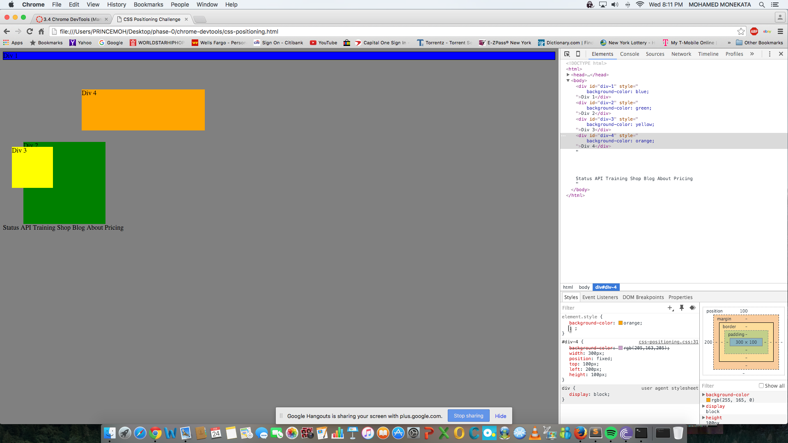
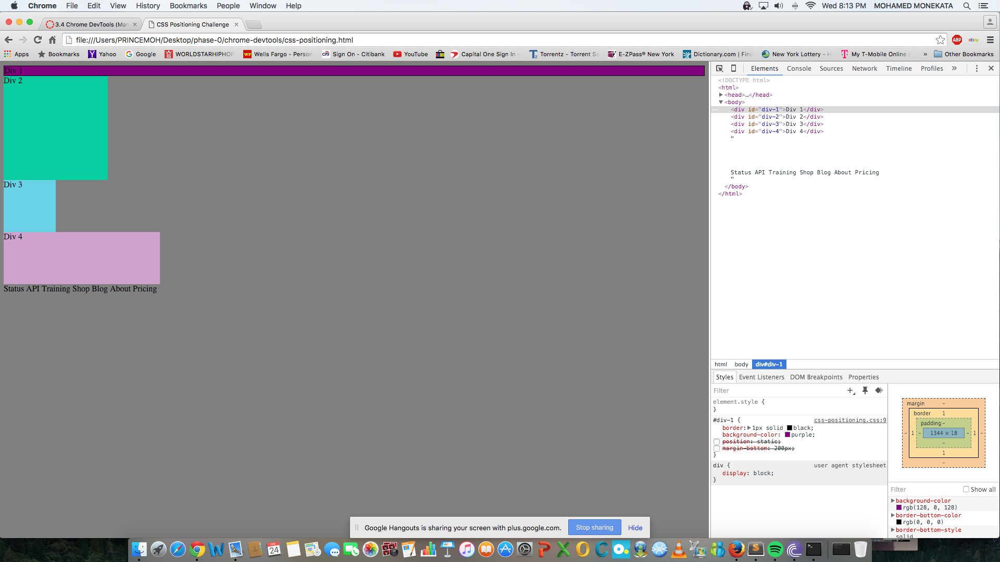
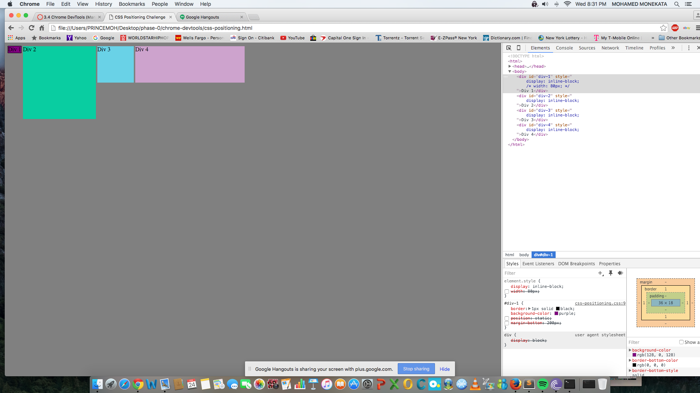
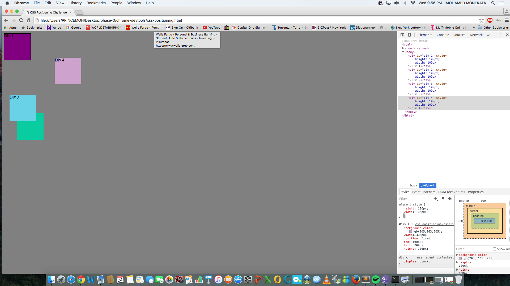
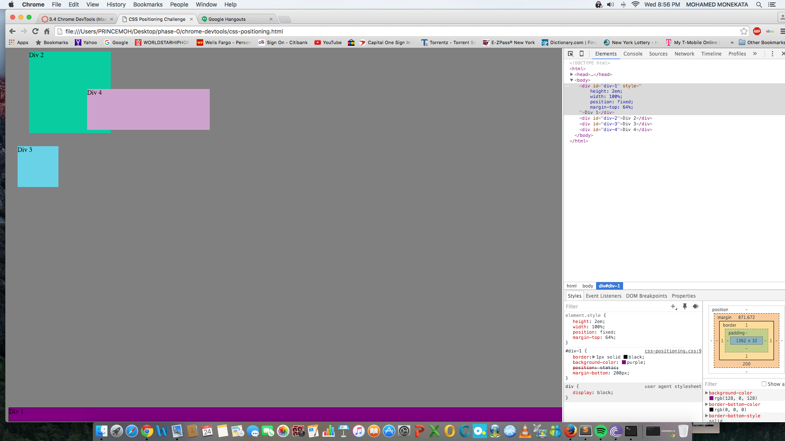
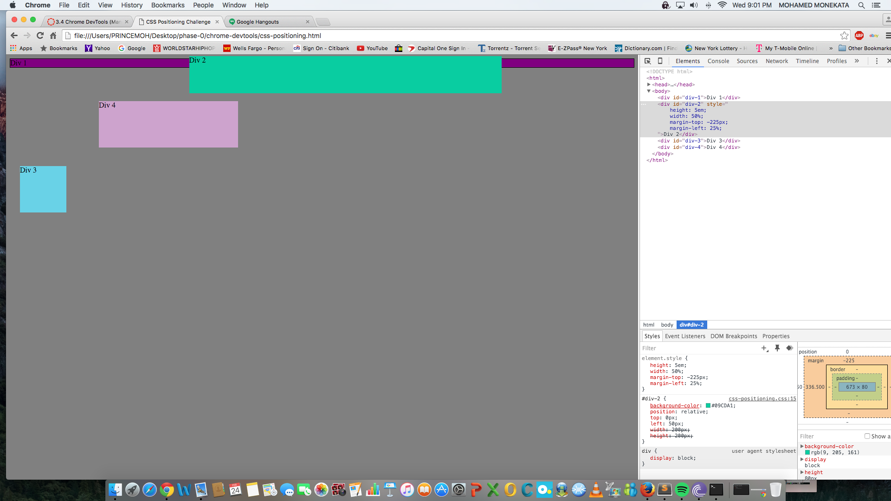
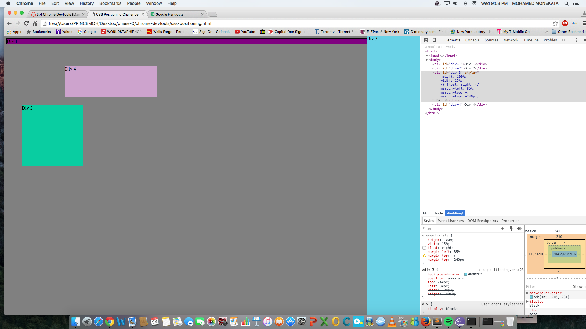
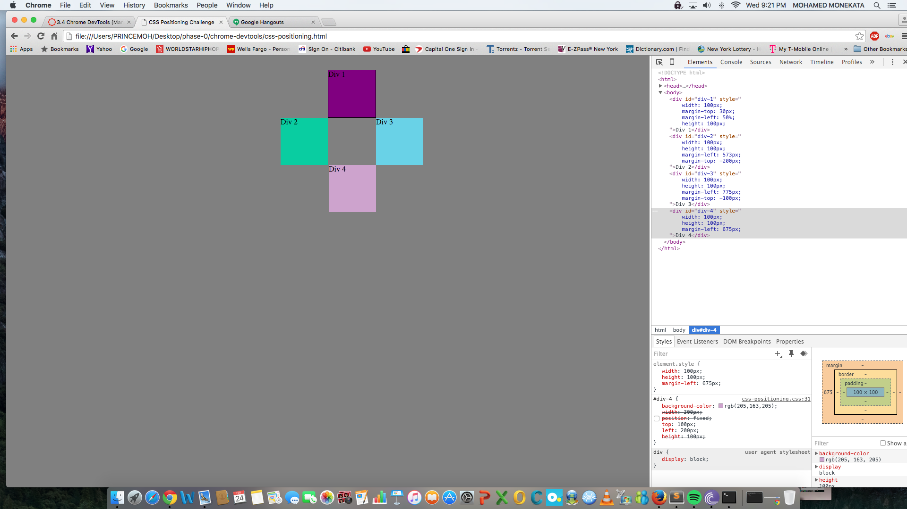

How can you use Chrome's DevTools inspector to help you format or position elements?
You can use chrome's DevTools to test out different layouts and live-edit css so there are a bunch of different commands you can use to format and position elements, like the headers, "two-columns", "in-block", etc.

How can you resize elements on the DOM using CSS?
We resized items by messing with margins and position settings (absolute, fixed etc).

What are the differences between absolute, fixed, static, and relative positioning? Which did you find easiest to use? Which was most difficult?
Absolute position elements do not affect the positioning of other items, it is like it has been taken out of the page and can be displayed exactly where the designer desires, without regard to the rest of the page. Fixed position means the item will stay in view even as the user scrolls down the screen. Static positioning means the item will display where it is expected to in the html. Relative positioning will change the item in regards to its original positioning, it will not take into account other items positioned on the page.
I prefered fixed positioning because once you add the css the item won't be affected by any other changes you make. Static was more difficult because other changes would affect it.

What are the differences between margin, border, and padding?
IF you were going to use a picture frame analogy the margin is the wall itself, the border is the frame, and the padding is mat in the frame.

What was your impression of this challenge overall? (love, hate, and why?)
I enjoyed this challenge, but did find some of the exercises more difficult especially number 4. It was interesting seeing how there were different ways you could complete each exercise but some were smarter than others because later on you would regret doing something convuluted because it would make the later exercise more difficult.